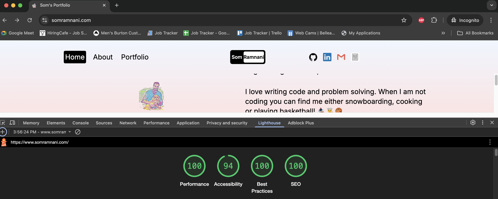

# Som's Portfolio Website

Portfolio site built with Astro, Three.js, and Tailwind CSS. 

## 🛠️ Technologies
- Astro
- Three.js
- Tailwind CSS
- Vercel

## ✨ Features

- One-page portfolio structure
- Three.js hero animation
- Smooth anchor navigation
- Responsive layout for mobile and desktop
- Project showcase section

## 🎯 Lighthouse Score

